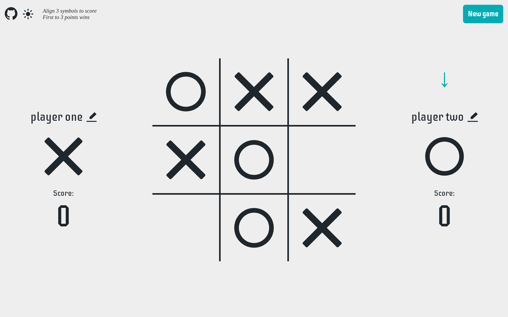

# Tic Tac Toe Game  
A classic Tic Tac Toe game with custom enhancements. Built with vanilla JavaScript, HTML, and CSS. Developed as part of The Odin Project curriculum but expanded with additional features for a personalized experience.

## Core Features  
- **Two-player mode** with alternating turns  
- **Custom symbol design**  
- **Custom board size** (Classic, L, XL, Extreme)  
- **Custom win score**
- **Theme toggle** (Dark/Light modes)

A live version can be found [Here](https://fran-dv.github.io/tic-tac-toe/).

